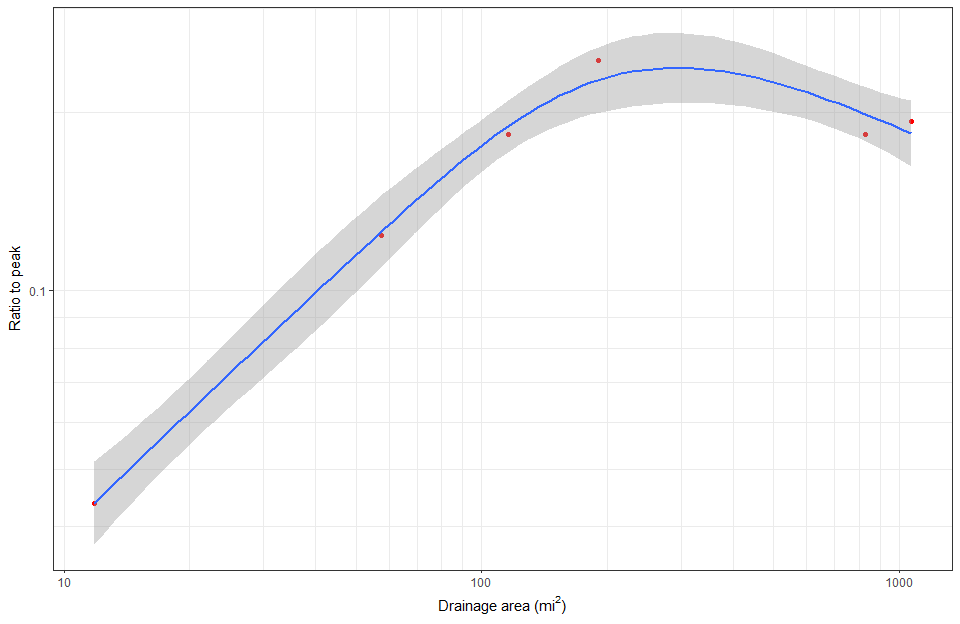
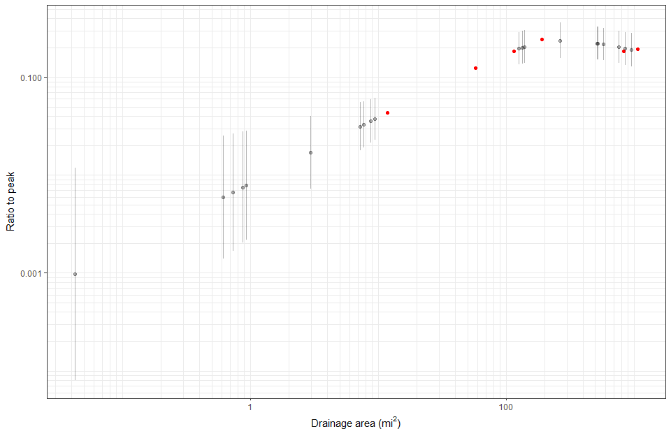

Ratio To Peak Function Demo
================
Brian K Breaker

Background
==========

The function `ratioToPeakUV()` does a lot of things to arrive at a breakpoint in the recession of an event in a hydrograph. It computes a moving average based off the `nDays` argument. The `nDays` argument should be a number between 0.1 and 0.9. From that moving average, slope between points is computed and used to classify events. Slope between points is also computed for the raw data and used on recessions for breakpoint analysis.

The function uses the argument `eventProbs` to isolate the events to be analyzed. Best practice is to use a value between 0.995 and 0.999. A value of 0.995 will return more events than a value of 0.999. This is related to the quantile of the highest value in each event isolated by the code.

The function performs breakpoint analyses on the recession limb of each event using slope and discharge. The final breakpoint is selected by weighting the results of the breakpoint analyses from slope and discharge.

If the argument `getDF = TRUE`, a data frame containing the date and time, flow of the break point, peak flow of the event, and the recession constant are returned. If `getDF = FALSE`, a list is returned with the mean of the recession constants and number of events used is returned.

If the argument `siteID = NULL` is used, values are returned as in the previous paragaph. If the argument `siteID = "someCharString"` is used, the data will be retuned with the identifier `someCharString`. Any ID can be assigned.

Recession constants that are above the 95th percentile and below the 5th percentile are screened out.

Single Station
==============

For evaluation of a single USGS streamflow gaging station;

``` r
# to get the function into your R session
source("https://raw.githubusercontent.com/bbreaker/hydroParams/master/R/ratioToPeakUV.R")

# I'm going to pull in some data for one USGS streamgage
library(dataRetrieval)
site <- c("07055680")

# starting time for data for analysis
startDate <- "2008-10-01"

# ending time for data for analysis
endDate <- "2017-09-30"

# read in the unit value data for the site
library(dataRetrieval)
uvDat <- readNWISuv(site, startDate = startDate, endDate = endDate, 
                    parameterCd = "00060")
uvDat <- renameNWISColumns(uvDat)

# apply the ratioToPeakUV function
rKval <- ratioToPeakUV(flow = uvDat$Flow_Inst, dates = uvDat$dateTime, 
                       siteID = "07055680", getDF = TRUE, eventProb = 0.999)

# look at the ouput table
knitr::kable(rKval)
```

| siteID   | dates               |  breakFlow|  eventPeak|      kVal|
|:---------|:--------------------|----------:|----------:|---------:|
| 07055680 | 2009-09-23 06:00:00 |       2250|      13200|  0.170455|
| 07055680 | 2011-04-26 17:00:00 |       6380|      26900|  0.237175|
| 07055680 | 2015-05-12 07:30:00 |       3200|      13500|  0.237037|
| 07055680 | 2015-06-16 21:45:00 |       4060|      18400|  0.220652|
| 07055680 | 2017-04-23 01:15:00 |       3310|      12600|  0.262698|
| 07055680 | 2017-04-27 12:45:00 |       3480|      13400|  0.259701|
| 07055680 | 2017-04-30 20:00:00 |       7560|      23600|  0.320339|

``` r
# plot the events isolated by the function
library(ggplot2)
p1 <- ggplot(data = uvDat, aes(x = dateTime, y = Flow_Inst)) + 
  geom_line(color = "blue") +
  geom_point(data = rKval, aes(x = dates, y = breakFlow), 
             alpha = 1, fill = "red", pch = 21, size = 3) +
  labs(x = "Date", y = "Flow (cfs)") +
  scale_y_continuous(labels = scales::comma, limits = c(0, rKval[1, 4])) + 
  scale_x_datetime(limits = c(as.POSIXct("2009-09-21 05:30:00"), 
                              as.POSIXct("2009-09-25 03:15:00"))) +
  theme_bw()

p2 <- ggplot(data = uvDat, aes(x = dateTime, y = Flow_Inst)) + 
  geom_line(color = "blue") +
  geom_point(data = rKval, aes(x = dates, y = breakFlow), 
             alpha = 1, fill = "red", pch = 21, size = 3) +
  labs(x = "Date", y = "Flow (cfs)") +
  scale_y_continuous(labels = scales::comma, limits = c(0, rKval[2, 4])) + 
  scale_x_datetime(limits = c(as.POSIXct("2011-04-23 11:30:00"), 
                              as.POSIXct("2011-04-29 02:00:00"))) +
  theme_bw()

p3 <- ggplot(data = uvDat, aes(x = dateTime, y = Flow_Inst)) + 
  geom_line(color = "blue") +
  geom_point(data = rKval, aes(x = dates, y = breakFlow), 
             alpha = 1, fill = "red", pch = 21, size = 3) +
  labs(x = "Date", y = "Flow (cfs)") +
  scale_y_continuous(labels = scales::comma, limits = c(0, rKval[3, 4])) + 
  scale_x_datetime(limits = c(as.POSIXct("2015-05-09 11:30:00"), 
                              as.POSIXct("2015-05-15 05:30:00"))) +
  theme_bw()

p4 <- ggplot(data = uvDat, aes(x = dateTime, y = Flow_Inst)) + 
  geom_line(color = "blue") +
  geom_point(data = rKval, aes(x = dates, y = breakFlow), 
             alpha = 1, fill = "red", pch = 21, size = 3) +
  labs(x = "Date", y = "Flow (cfs)") +
  scale_y_continuous(labels = scales::comma, limits = c(0, rKval[4, 4])) + 
  scale_x_datetime(limits = c(as.POSIXct("2015-06-14 06:00:00"), 
                              as.POSIXct("2015-06-17 01:30:00"))) +
  theme_bw()

p5 <- ggplot(data = uvDat, aes(x = dateTime, y = Flow_Inst)) + 
  geom_line(color = "blue") +
  geom_point(data = rKval, aes(x = dates, y = breakFlow), 
             alpha = 1, fill = "red", pch = 21, size = 3) +
  labs(x = "Date", y = "Flow (cfs)") +
  scale_y_continuous(labels = scales::comma, limits = c(0, rKval[5, 4])) + 
  scale_x_datetime(limits = c(as.POSIXct("2017-04-21 12:30:00"), 
                              as.POSIXct("2017-04-24 01:30:00"))) +
  theme_bw()

p6 <- ggplot(data = uvDat, aes(x = dateTime, y = Flow_Inst)) + 
  geom_line(color = "blue") +
  geom_point(data = rKval, aes(x = dates, y = breakFlow), 
             alpha = 1, fill = "red", pch = 21, size = 3) +
  labs(x = "Date", y = "Flow (cfs)") +
  scale_y_continuous(labels = scales::comma, limits = c(0, rKval[6, 4])) + 
  scale_x_datetime(limits = c(as.POSIXct("2017-04-26 06:00:00"), 
                              as.POSIXct("2017-04-28 08:30:00"))) +
  theme_bw()

p7 <- ggplot(data = uvDat, aes(x = dateTime, y = Flow_Inst)) + 
  geom_line(color = "blue") +
  geom_point(data = rKval, aes(x = dates, y = breakFlow), 
             alpha = 1, fill = "red", pch = 21, size = 3) +
  labs(x = "Date", y = "Flow (cfs)") +
  scale_y_continuous(labels = scales::comma, limits = c(0, rKval[7, 4])) + 
  scale_x_datetime(limits = c(as.POSIXct("2017-04-29 12:00:00"), 
                              as.POSIXct("2017-05-01 13:00:00"))) +
  theme_bw()

library(gridExtra)
grid.arrange(p1, p2, p3, p4, p5, p6, p7, ncol = 2)
```


Regional Analysis
=================

If you have a hydrologic model and need recession constants for several subbasins, the simplified example below may be a good place to start.

``` r
# USGS streamgages in the area
# I'm using some Buffalo River basin gages and some others to get 
# smaller drainage areas for this demo
sites <- c("07048495", "07055646", "07055660", "07055680", "07056000", "07056700")

# starting time for data for analysis
startDate <- "2008-10-01"

# ending time for data for analysis
endDate <- "2017-09-30"

# read in the unit value data for the site
library(dataRetrieval)
uvDat <- readNWISuv(sites, startDate = startDate, endDate = endDate, 
                    parameterCd = "00060")
uvDat <- renameNWISColumns(uvDat)

# for this demonstration, I'm just going to use a simple for loop...
# if I were doing this for a project, I would probably use foreach() and doParallel()
# to use multiple core to speed everthing up
# first, run the analysis on the first site in the site ID vector
subUvDat <- dplyr::filter(uvDat, site_no == sites[1])

rKval <- ratioToPeakUV(flow = subUvDat$Flow_Inst, dates = subUvDat$dateTime, 
                       siteID = sites[1], getDF = TRUE, eventProb = 0.999)

# then, run the rest of the sites and add the results to the data frame above
for (i in 2:length(sites)) {
  subUvDat <- filter(uvDat, site_no == sites[i])
  rKval_ <- ratioToPeakUV(flow = subUvDat$Flow_Inst, dates = subUvDat$dateTime, 
                          siteID = sites[i], getDF = TRUE, eventProb = 0.999)
  rKval <- dplyr::bind_rows(rKval, rKval_)
}

# get the site files for the sites
siteInfo <- readNWISsite(sites)

# just keep the site number and drainage area
siteInfo <- siteInfo[, c(2, 30)]

# change the name of the site number to match what we are using
names(siteInfo)[1] <- "siteID"

# just get the median recession constant for each site and add the drainage area 
# using dplyr 
library(dplyr)
rKval <- rKval %>% 
  dplyr::group_by(siteID) %>% 
  dplyr::summarize(kVal = median(kVal))

rKval <- left_join(rKval, siteInfo, "siteID")

# add the drainage area value for 07048495... for some reason, it wasn't in NWIS
rKval[1, 3] <- 11.8

# plot recession constant vs drainage area
library(ggplot2)
ggplot(data = rKval, aes(x = drain_area_va, y = kVal)) + 
  geom_point(color = "red") +
  scale_x_log10(minor_breaks = c(-3:10 %o% 10^(-3:10))) +
  scale_y_log10(minor_breaks = c(-3:10 %o% 10^(-3:10))) +
  stat_smooth(method = "gam", formula = y ~ s(x, k = 4)) +
  labs(x = expression(paste("Drainage area (", mi^2, ")")), 
       y = "Ratio to peak") +
  theme_bw()
```



``` r
# generate some random drainage areas to demonstrate using GAM to estimate 
# recession constants for subbasins
# create the GAM model
library(mgcv)
gamMod <- gam(log10(kVal) ~ s(log10(drain_area_va), k = 4), data = rKval)

# generate 10 random numbers between 1 and 1000 from the uniform distribution
# put the numbers in a data frame and name the random numbers the same as the
# explanatory variable in the GAM model
randoDrnAreas <- data.frame(drain_area_va = c(runif(5, 0.001, 1), 
                                              runif(5, 1, 10), 
                                              runif(10, 10, 1000)))

# predict recession constants on the data frame
gamPred <- predict(gamMod, randoDrnAreas, se.fit = TRUE)

# source a function to add prediction intervals to GAM regression
source("https://raw.githubusercontent.com/bbreaker/hydroParams/master/R/gamIntervals.R")

# apply the function to get the prediction intervals
gamFit <- gamIntervals(gamPred, gamMod, interval = "prediction")

# convert relevant data back to normal space
gamFit[, 1:3] <- 10^gamFit[, 1:3]

# add the drainage areas to gamFit
gamFit$drain_area_va <- randoDrnAreas$drain_area_va

# plot recession constant vs drainage area with the predicted values
ggplot(data = rKval, aes(x = drain_area_va, y = kVal)) + 
  geom_point(color = "red") +
  scale_x_log10(minor_breaks = c(-3:10 %o% 10^(-3:10))) +
  scale_y_log10(minor_breaks = c(-7:10 %o% 10^(-7:10))) +
  geom_point(data = gamFit, aes(x = drain_area_va, y = fit), 
             inherit.aes = FALSE, color = "black", alpha = 0.3) + 
  geom_linerange(data = gamFit, aes(x = drain_area_va, ymin = lwr, ymax = upr), 
                inherit.aes = FALSE, width = 0.2, alpha = 0.3) +
  labs(x = expression(paste("Drainage area (", mi^2, ")")), 
       y = "Ratio to peak") +
  theme_bw()
```


